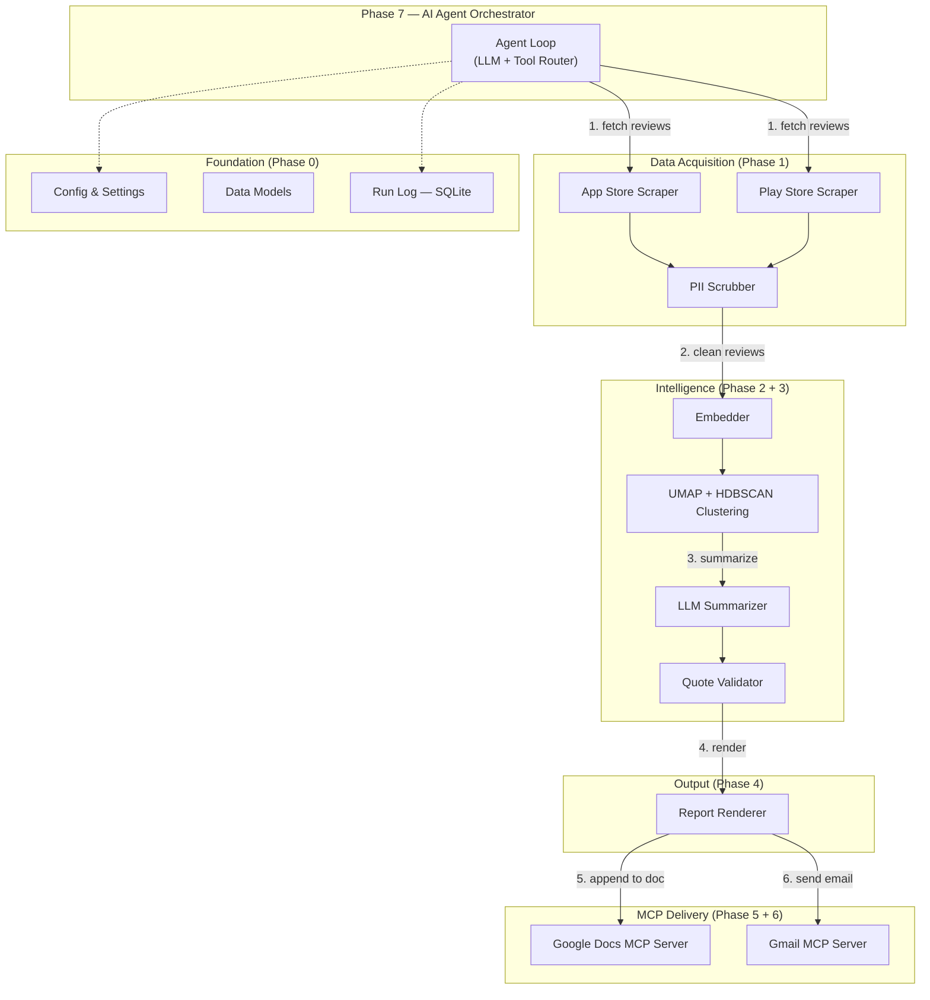
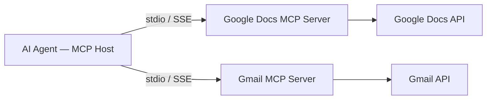

# Architecture — Weekly Product Review Pulse AI Agent

## 1. System Overview

The **Weekly Product Review Pulse** is an **AI Agent** that autonomously:

1. Scrapes public App Store and Google Play reviews for configured fintech products.
2. Clusters the reviews into natural themes using embeddings and density-based clustering.
3. Summarizes each cluster with an LLM — naming themes, selecting verbatim quotes, and generating action ideas.
4. Renders a structured one-page pulse report.
5. Appends that report to a product-specific Google Doc via a **Google Docs MCP server**.
6. Sends a teaser notification email via a **Gmail MCP server**.

The agent is an **MCP host / client**; it never embeds Google credentials or calls Workspace REST APIs directly. All human-visible delivery flows through dedicated MCP servers.

---

## 2. High-Level Architecture Diagram



---

## 3. Phase Breakdown & Module Map

| Phase | Name | Directory | Responsibility |
|-------|------|-----------|----------------|
| 0 | Foundations | `src/phase0_foundations/` | Config, data models (Pydantic), run log, shared utilities |
| 1 | Ingestion | `src/phase1_ingestion/` | App Store RSS scraper, Play Store scraper, PII scrubber, deduplication |
| 2 | Clustering | `src/phase2_clustering/` | Sentence-transformer embeddings → UMAP → HDBSCAN |
| 3 | Summarization | `src/phase3_summarization/` | LLM prompts for theme naming, quote selection, action ideas; quote validator |
| 4 | Renderer | `src/phase4_renderer/` | Structured report assembly (Markdown for Docs, HTML for email) |
| 5 | Docs MCP | `src/phase5_docs_mcp/` | MCP client wrapper for Google Docs — append section, idempotency check |
| 6 | Gmail MCP | `src/phase6_gmail_mcp/` | MCP client wrapper for Gmail — compose teaser, send/draft, deep-link insertion |
| 7 | Orchestration | `src/phase7_orchestration/` | AI Agent loop — tool registry, LLM reasoning, step sequencing, error handling |

---

## 4. Data Flow (End-to-End)

```
┌─────────────────────────────────────────────────────────────────────────┐
│  AGENT ORCHESTRATOR (Phase 7)                                          │
│                                                                         │
│  Step 1 ─► Ingestion Tool (Phase 1)                                    │
│            ├── App Store RSS → parse XML → normalize                   │
│            ├── Play Store scraper → parse HTML → normalize              │
│            └── PII Scrubber → redact emails, phones, IDs               │
│            Returns: List[CleanReview]                                   │
│                                                                         │
│  Step 2 ─► Clustering Tool (Phase 2)                                   │
│            ├── Embed reviews (sentence-transformers)                    │
│            ├── UMAP dimensionality reduction                           │
│            └── HDBSCAN density clustering                              │
│            Returns: List[Cluster] with representative reviews          │
│                                                                         │
│  Step 3 ─► Summarization Tool (Phase 3)                                │
│            ├── LLM names each cluster as a theme                       │
│            ├── LLM selects ≤3 verbatim quotes per theme                │
│            ├── Quote Validator verifies quotes against raw text         │
│            └── LLM generates ≤2 action ideas per theme                 │
│            Returns: PulseReport (themes, quotes, actions)              │
│                                                                         │
│  Step 4 ─► Renderer Tool (Phase 4)                                     │
│            ├── Build Markdown body for Google Docs                      │
│            └── Build HTML teaser for Gmail                              │
│            Returns: RenderedReport (doc_body, email_html)              │
│                                                                         │
│  Step 5 ─► Google Docs MCP Tool (Phase 5)                              │
│            ├── Check idempotency (heading exists for this week?)        │
│            ├── Append dated section to product Doc                      │
│            └── Retrieve section heading link                            │
│            Returns: doc_url, heading_id                                │
│                                                                         │
│  Step 6 ─► Gmail MCP Tool (Phase 6)                                    │
│            ├── Compose teaser email with deep-link to Doc section       │
│            └── Send (or draft in staging)                               │
│            Returns: message_id                                         │
│                                                                         │
│  Step 7 ─► Log run metadata to Run Log (Phase 0)                      │
└─────────────────────────────────────────────────────────────────────────┘
```

---

## 5. Core Data Models

### 5.1 Review (raw + cleaned)
```python
class Review(BaseModel):
    review_id: str
    product: str               # e.g. "Groww"
    store: Literal["appstore", "playstore"]
    rating: int                # 1-5
    title: Optional[str]
    text: str
    date: datetime
    language: str = "en"

class CleanReview(Review):
    original_text: str         # preserved before PII scrub
    is_pii_scrubbed: bool = True
```

### 5.2 Cluster
```python
class Cluster(BaseModel):
    cluster_id: int
    label: Optional[str]       # assigned by HDBSCAN, -1 = noise
    reviews: List[CleanReview]
    centroid_indices: List[int] # top-k closest to centroid
```

### 5.3 PulseReport
```python
class Theme(BaseModel):
    name: str
    description: str
    quotes: List[str]          # validated verbatim quotes
    action_ideas: List[str]

class PulseReport(BaseModel):
    product: str
    iso_week: str              # e.g. "2026-W17"
    period: str                # e.g. "Last 12 weeks"
    review_count: int
    themes: List[Theme]
    generated_at: datetime
```

### 5.4 RenderedReport
```python
class RenderedReport(BaseModel):
    product: str
    iso_week: str
    doc_markdown: str          # for Google Docs append
    email_html: str            # for Gmail teaser
    heading_anchor: str        # stable ID for idempotency
```

### 5.5 RunRecord
```python
class RunRecord(BaseModel):
    run_id: str
    product: str
    iso_week: str
    status: Literal["success", "failed", "skipped"]
    doc_id: Optional[str]
    heading_id: Optional[str]
    email_message_id: Optional[str]
    review_count: int
    token_usage: int
    started_at: datetime
    completed_at: Optional[datetime]
```

---

## 6. MCP Integration Architecture

### 6.1 Agent as MCP Host

The agent connects to **two external MCP servers** using the MCP Python SDK (`mcp` package). Each server exposes tools that the agent calls through a standardized protocol.



### 6.2 Google Docs MCP — Tools Used
| Tool | Purpose |
|------|---------|
| `docs_get_document` | Read existing Doc to check for duplicate headings |
| `docs_batch_update` | Append a new dated section (heading + body) |

### 6.3 Gmail MCP — Tools Used
| Tool | Purpose |
|------|---------|
| `gmail_create_draft` | Create a draft email (staging mode) |
| `gmail_send_message` | Send the teaser email (production mode) |

### 6.4 Credential Isolation
- Google OAuth tokens live **inside the MCP server's configuration** — never in agent code or `.env`.
- The agent authenticates to MCP servers via **stdio transport** (local) or **SSE transport** (remote).

---

## 7. Idempotency Strategy

| Check | Where | How |
|-------|-------|-----|
| Duplicate Doc section | Phase 5 | Read Doc headings; if `"Week {iso_week}"` heading exists → skip append |
| Duplicate email | Phase 6 | Query `run_log` for `(product, iso_week)` with `email_message_id != null` → skip send |
| Re-run safety | Phase 7 | Orchestrator checks `run_log` at start; if `status=success` → skip entire run |

---

## 8. Security & Safety

- **PII scrubbing** (Phase 1): Regex + pattern matching removes emails, phone numbers, Aadhaar-like IDs before any LLM call.
- **Reviews as data**: System prompts instruct the LLM to treat review text as data to summarize — never as instructions to execute.
- **Cost / token limits**: Each run enforces a configurable token budget; exceeding it aborts gracefully.
- **Audit trail**: Every tool call (input hash + output hash + timestamp) is recorded in `run_log.db`.

---

## 9. Directory Structure

```
M3/
├── docs/
│   ├── problemStatement.md
│   ├── architecture.md           ← this file
│   ├── implementationPlan.md
│   ├── evaluations.md
│   └── edge_cases.md
├── src/
│   ├── __init__.py
│   ├── phase0_foundations/
│   │   ├── __init__.py
│   │   ├── config.py             # Settings via pydantic-settings
│   │   ├── models.py             # All Pydantic data models
│   │   └── run_log.py            # SQLite run-log CRUD
│   ├── phase1_ingestion/
│   │   ├── __init__.py
│   │   ├── appstore_scraper.py
│   │   ├── playstore_scraper.py
│   │   └── pii_scrubber.py
│   ├── phase2_clustering/
│   │   ├── __init__.py
│   │   ├── embedder.py
│   │   └── clusterer.py
│   ├── phase3_summarization/
│   │   ├── __init__.py
│   │   ├── prompts.py
│   │   ├── synthesizer.py
│   │   └── quote_validator.py
│   ├── phase4_renderer/
│   │   ├── __init__.py
│   │   ├── doc_renderer.py
│   │   └── email_renderer.py
│   ├── phase5_docs_mcp/
│   │   ├── __init__.py
│   │   └── docs_client.py
│   ├── phase6_gmail_mcp/
│   │   ├── __init__.py
│   │   └── gmail_client.py
│   └── phase7_orchestration/
│       ├── __init__.py
│       ├── agent.py
│       └── tool_registry.py
├── tests/
│   ├── test_phase0.py
│   ├── test_phase1.py
│   ├── test_phase2.py
│   ├── test_phase3.py
│   ├── test_phase4.py
│   ├── test_phase5.py
│   ├── test_phase6.py
│   └── test_phase7.py
├── config/
│   └── settings.py
├── .env.example
├── requirements.txt
└── README.md
```
