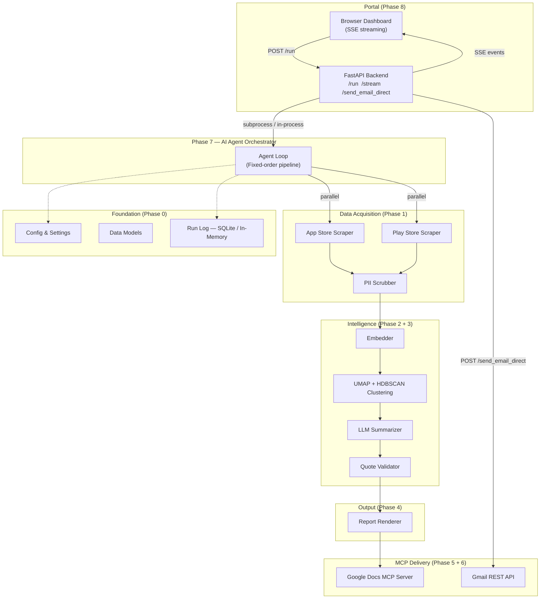
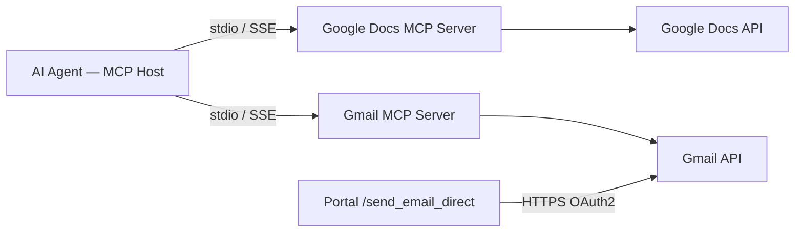

# Architecture — Weekly Product Review Pulse AI Agent

## 1. System Overview

The **Weekly Product Review Pulse** is an **AI Agent** that autonomously:

1. Scrapes public App Store and Google Play reviews for configured fintech products — in parallel.
2. Clusters the reviews into natural themes using embeddings and density-based clustering.
3. Summarizes each cluster with an LLM — naming themes, selecting verbatim quotes, and generating action ideas.
4. Renders a structured one-page pulse report.
5. Appends that report to a product-specific Google Doc via a **Google Docs MCP server**.
6. Sends a teaser notification email via the **Gmail REST API**.

A browser-based **Portal** (FastAPI + SSE) provides real-time pipeline monitoring and a one-click Send Email button. The system is deployed on **HuggingFace Spaces** (Docker) for free public access.

---

## 2. High-Level Architecture Diagram



---

## 3. Phase Breakdown & Module Map

| Phase | Name | Directory | Responsibility |
|-------|------|-----------|----------------|
| 0 | Foundations | `src/phase0_foundations/` | Config, data models (Pydantic), run log (SQLite + in-memory fallback) |
| 1 | Ingestion | `src/phase1_ingestion/` | Parallel App Store + Play Store scraping, PII scrubber, deduplication |
| 2 | Clustering | `src/phase2_clustering/` | Sentence-transformer embeddings → UMAP (n_neighbors=5) → HDBSCAN |
| 3 | Summarization | `src/phase3_summarization/` | LLM prompts, quote validator, token budgeting |
| 4 | Renderer | `src/phase4_renderer/` | Markdown doc renderer, HTML email renderer |
| 5 | Docs MCP | `src/phase5_docs_mcp/` | MCP client for Google Docs — append section, idempotency check |
| 6 | Gmail MCP | `src/phase6_gmail_mcp/` | MCP client for Gmail (stdio / SSE transport) |
| 7 | Orchestration | `src/phase7_orchestration/` | Fixed-order agent pipeline, retry logic, run lifecycle |
| 8 | Portal | `src/portal/` | FastAPI + SSE backend, browser dashboard, Gmail API email send |
| 9 | Deployment | `Dockerfile`, `entrypoint.sh`, `railway.toml` | HuggingFace Spaces Docker deployment |

---

## 4. Data Flow (End-to-End)

```
┌─────────────────────────────────────────────────────────────────────────┐
│  PORTAL (Phase 8)                                                       │
│  Browser → POST /run → FastAPI → agent subprocess (or in-process)      │
│  Agent stdout → SSE events → Browser (live phase cards + terminal)     │
└──────────────────────────────┬──────────────────────────────────────────┘
                               │
┌──────────────────────────────▼──────────────────────────────────────────┐
│  AGENT ORCHESTRATOR (Phase 7)                                           │
│                                                                         │
│  Step 1 ─► Ingestion Tool (Phase 1) — PARALLEL                         │
│            ├── App Store RSS + Play Store scraper (ThreadPoolExecutor)  │
│            └── PII Scrubber → redact emails, phones, IDs, emojis       │
│            Returns: List[CleanReview]                                   │
│                                                                         │
│  Step 2 ─► Clustering Tool (Phase 2)                                   │
│            ├── Embed reviews (all-MiniLM-L6-v2, local cache first)     │
│            ├── UMAP reduction (n_neighbors=5, ~2x faster than default) │
│            └── HDBSCAN density clustering (min_cluster_size=5)         │
│            Returns: List[Cluster] with representative reviews           │
│                                                                         │
│  Step 3 ─► Summarization Tool (Phase 3)                                │
│            ├── LLM names each cluster as a theme                        │
│            ├── LLM selects ≤3 verbatim quotes per theme                 │
│            ├── Quote Validator verifies quotes against raw text          │
│            └── LLM generates ≤2 action ideas per theme                  │
│            Returns: PulseReport (themes, quotes, actions)               │
│                                                                         │
│  Step 4 ─► Renderer Tool (Phase 4)                                      │
│            ├── Build Markdown body for Google Docs                      │
│            └── Build HTML teaser for Gmail                              │
│            Returns: RenderedReport (doc_body, email_html)               │
│                                                                         │
│  Step 5 ─► Google Docs MCP Tool (Phase 5)                              │
│            ├── Check idempotency (heading exists for this week?)        │
│            ├── Append dated section to product Doc                      │
│            └── Retrieve section heading link                            │
│            Returns: doc_url, heading_id                                 │
│                                                                         │
│  Step 6 ─► Email — paused for user approval (--pause-email flag)       │
│            Portal receives email_html + subject via [RESULT_JSON]       │
│            User clicks "Send Email" → POST /send_email_direct           │
│            → Gmail REST API (HTTPS/443) → email delivered               │
│                                                                         │
│  Step 7 ─► Log run metadata to Run Log (Phase 0)                       │
└─────────────────────────────────────────────────────────────────────────┘
```

---

## 5. Core Data Models

### 5.1 Review (raw + cleaned)
```python
class Review(BaseModel):
    review_id: str
    product: str
    store: Literal["appstore", "playstore"]
    rating: int
    title: Optional[str]
    text: str
    date: datetime
    language: str = "en"

class CleanReview(Review):
    original_text: str
    is_pii_scrubbed: bool = True
```

### 5.2 Cluster
```python
class Cluster(BaseModel):
    cluster_id: int
    label: Optional[str]
    reviews: List[CleanReview]
    centroid_indices: List[int]
```

### 5.3 PulseReport
```python
class Theme(BaseModel):
    name: str
    description: str
    quotes: List[str]
    action_ideas: List[str]

class PulseReport(BaseModel):
    product: str
    iso_week: str
    period: str
    review_count: int
    themes: List[Theme]
    generated_at: datetime
```

### 5.4 RunRecord
```python
class RunRecord(BaseModel):
    run_id: str
    product: str
    iso_week: str
    status: Literal["success", "failed", "pending_email"]
    doc_id: Optional[str]
    heading_id: Optional[str]
    email_message_id: Optional[str]
    review_count: int
    token_usage: int
    started_at: datetime
    completed_at: Optional[datetime]
```

---

## 6. MCP Integration Architecture

### 6.1 Agent as MCP Host



### 6.2 Google Docs MCP — Tools Used
| Tool | Purpose |
|------|---------|
| `docs_get_document` | Read existing Doc to check for duplicate headings |
| `docs_batch_update` | Append a new dated section (heading + body) |

### 6.3 Email Sending — Two Paths
| Path | Used When | Transport |
|------|-----------|-----------|
| Gmail MCP server | Agent pipeline (phase 6) | stdio or SSE |
| Gmail REST API | Portal "Send Email" button | HTTPS / OAuth2 refresh token |

The portal's `/send_email_direct` endpoint uses the Gmail REST API directly (not SMTP). This is required on HuggingFace Spaces where outbound SMTP ports (465/587) are blocked at the network level. Authentication uses an OAuth2 refresh token stored as a Space secret.

### 6.4 Credential Isolation
- Google service account credentials live in `GOOGLE_CREDENTIALS_BASE64` env var — decoded to `credentials.json` at container startup by `entrypoint.sh`.
- Gmail OAuth2 credentials (`GMAIL_CLIENT_ID`, `GMAIL_CLIENT_SECRET`, `GMAIL_REFRESH_TOKEN`) stored as HF Space secrets — never in the image or repository.

---

## 7. Portal Architecture

```
Browser
  │  GET /              ← serves index.html
  │  POST /run          ← starts agent subprocess, returns run_id
  │  GET /stream/{id}   ← SSE stream of pipeline events
  │  POST /send_email_direct ← sends email via Gmail REST API
  │
FastAPI (src/portal/app.py)
  │
  ├─ Subprocess path (Linux / HF Spaces)
  │   asyncio.create_subprocess_exec → agent stdout → SSE events
  │
  └─ In-process fallback (Windows policy blocks subprocess)
      asyncio.to_thread(_run_pipeline_inproc) → emit() → SSE events
```

### SSE Event Types
| Event | Meaning |
|-------|---------|
| `phase_start` | A pipeline phase began |
| `phase_done` | A pipeline phase completed successfully |
| `phase_paused` | Email drafted, awaiting user approval |
| `awaiting_send` | Run complete, Send Email button shown |
| `result` | Final JSON payload (themes, doc_url, email_html) |
| `fatal` | Unrecoverable error with full traceback |
| `done` | Stream closed |

---

## 8. Idempotency Strategy

| Check | Where | How |
|-------|-------|-----|
| Duplicate Doc section | Phase 5 | Read Doc headings; if `"Week {iso_week}"` heading exists → skip append |
| Duplicate email | Phase 6 | Query `run_log` for `(product, iso_week)` with `email_message_id != null` → skip send |
| Re-run safety | Phase 7 | Orchestrator checks `run_log` at start; if `status=success` → skip entire run |

---

## 9. Deployment Architecture

```
GitHub (main branch)
    │
    ├─► HuggingFace Spaces (primary — free)
    │     Dockerfile → python:3.11-slim
    │     Pre-bakes all-MiniLM-L6-v2 model (avoids cold-start downloads)
    │     entrypoint.sh: decodes GOOGLE_CREDENTIALS_BASE64 → credentials.json
    │     Port 7860 (HF Spaces default)
    │     Secrets: GROQ_API_KEY, GOOGLE_DOCS_ID, GMAIL_CLIENT_ID,
    │              GMAIL_CLIENT_SECRET, GMAIL_REFRESH_TOKEN,
    │              GOOGLE_CREDENTIALS_BASE64, RECIPIENT_EMAIL,
    │              SENDER_EMAIL, GOOGLE_DOCS_MCP_SERVER_URL
    │
    └─► Railway (alternative)
          railway.toml → health check + restart policy
          PORT env var injected automatically
```

**Live URL**: https://huggingface.co/spaces/Shakshi-970/app-review-insights-analyser

---

## 10. Security & Safety

- **PII & Emoji scrubbing** (Phase 1): Removes emails, phone numbers, Aadhaar-like IDs, and emojis before any LLM call.
- **Reviews as data**: System prompts instruct the LLM to treat review text as data to summarize — never as instructions to execute.
- **Cost / token limits**: Each run enforces a configurable token budget; exceeding it aborts gracefully.
- **No SMTP credentials in cloud**: HF Spaces uses Gmail REST API with OAuth2 refresh token; app passwords never leave local `.env`.
- **Credentials never in image**: `credentials.json` decoded from env var at runtime; all secrets injected via HF Space secrets.

---

## 11. Directory Structure

```
M3/
├── Dockerfile                    # HuggingFace Spaces / Railway container
├── entrypoint.sh                 # Decode credentials + launch uvicorn
├── railway.toml                  # Railway deployment config
├── requirements.txt              # All Python dependencies
├── .env.example                  # Environment variable template
├── scripts/
│   └── get_gmail_token.py        # One-time OAuth2 refresh token generator
├── docs/
│   ├── architecture.md           ← this file
│   ├── implementationPlan.md
│   ├── problemStatement.md
│   ├── evaluations.md
│   └── edge_cases.md
├── src/
│   ├── phase0_foundations/       # Config, models, run log
│   ├── phase1_ingestion/         # Scrapers, PII scrubber
│   ├── phase2_clustering/        # Embedder, UMAP + HDBSCAN
│   ├── phase3_summarization/     # Synthesizer, quote validator
│   ├── phase4_renderer/          # Doc + email renderers
│   ├── phase5_docs_mcp/          # Google Docs MCP client/server
│   ├── phase6_gmail_mcp/         # Gmail MCP client/server
│   ├── phase7_orchestration/     # Agent loop, CLI
│   └── portal/                   # FastAPI portal + index.html
├── tests/
│   └── test_foundations.py
└── hf-deploy/
    ├── docs-mcp/                 # Deployed Docs MCP Space
    └── gmail-mcp/                # Deployed Gmail MCP Space
```
