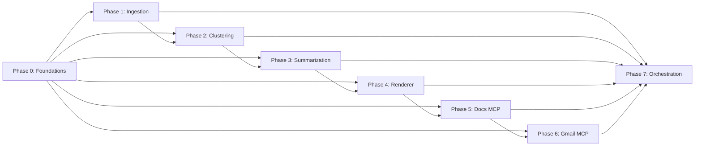

# Implementation Plan — Weekly Product Review Pulse AI Agent

This plan maps each phase to concrete tasks, files to create, dependencies, and exit criteria.

---

## Phase 0 — Foundations
**Directory**: `src/phase0_foundations/`
**Goal**: Establish shared infrastructure that every later phase depends on.

### Tasks
| # | Task | File(s) | Details |
|---|------|---------|---------|
| 0.1 | Centralized config | `config.py` | Use `pydantic-settings` to load `.env` — GROQ_API_KEY, product list, rolling window size, MCP server params |
| 0.2 | Data models | `models.py` | Define `Review`, `CleanReview`, `Cluster`, `Theme`, `PulseReport`, `RenderedReport`, `RunRecord` with Pydantic |
| 0.3 | Run log | `run_log.py` | SQLite-backed CRUD — `create_run`, `get_run`, `mark_success`, `mark_failed`, `exists(product, iso_week)` |
| 0.4 | Requirements | `requirements.txt` | Pin all dependencies for reproducibility |
| 0.5 | Environment template | `.env.example` | Document every expected env var |

### Exit Criteria
- All models serialize/deserialize without error.
- Run log can create, read, and update records.
- `config.py` loads settings from `.env` or falls back to defaults.

---

## Phase 1 — Ingestion
**Directory**: `src/phase1_ingestion/`
**Goal**: Fetch, normalize, and clean public reviews.

### Tasks
| # | Task | File(s) | Details |
|---|------|---------|---------|
| 1.1 | App Store scraper | `appstore_scraper.py` | Parse iTunes RSS XML; extract review_id, rating, title, text, date; handle pagination |
| 1.2 | Play Store scraper | `playstore_scraper.py` | Use `google-play-scraper` or Playwright; extract same fields; handle continuation tokens |
| 1.3 | PII scrubber | `pii_scrubber.py` | Regex patterns for emails, phones, Aadhaar-like IDs; preserve `original_text` before scrubbing |
| 1.4 | Deduplication | In scrapers | Deduplicate by `review_id` across runs |
| 1.5 | Rolling window filter | In scrapers | Only return reviews within `ROLLING_WINDOW_WEEKS` from today |

### Exit Criteria
- Scrapers return `List[CleanReview]` for at least 2 products.
- PII scrubber catches 100% of synthetic test PII patterns.
- No duplicate `review_id` values in output.

---

## Phase 2 — Clustering
**Directory**: `src/phase2_clustering/`
**Goal**: Group clean reviews into thematic clusters.

### Tasks
| # | Task | File(s) | Details |
|---|------|---------|---------|
| 2.1 | Embedder | `embedder.py` | Use `sentence-transformers/all-MiniLM-L6-v2`; batch-encode review texts; return NumPy array |
| 2.2 | Clusterer | `clusterer.py` | UMAP (n_neighbors=15, min_dist=0.1, n_components=5) → HDBSCAN (min_cluster_size=5); return `List[Cluster]` |
| 2.3 | Noise handling | `clusterer.py` | Reviews in cluster -1 (noise) are dropped or placed in an "Other" bucket |
| 2.4 | Representative selection | `clusterer.py` | For each cluster, select top-k reviews closest to centroid |

### Exit Criteria
- Given ≥50 reviews, produces ≥2 meaningful clusters.
- Each cluster contains a `centroid_indices` list of ≤10 representatives.
- Execution completes in <60s for 500 reviews.

---

## Phase 3 — Summarization
**Directory**: `src/phase3_summarization/`
**Goal**: Use the LLM to name themes, pick quotes, and generate action ideas.

### Tasks
| # | Task | File(s) | Details |
|---|------|---------|---------|
| 3.1 | Prompt templates | `prompts.py` | System prompt + per-cluster user prompt; include tone guide and output JSON schema |
| 3.2 | Synthesizer | `synthesizer.py` | Send cluster representatives to Groq/Llama3; parse structured JSON response into `Theme` objects |
| 3.3 | Quote validator | `quote_validator.py` | For each LLM-returned quote, verify it exists as a substring in the original review corpus; reject invalid quotes |
| 3.4 | Token budgeting | `synthesizer.py` | Track cumulative token usage; abort if budget exceeded |

### Exit Criteria
- Every quote in the output passes validation (100% grounded).
- LLM returns valid JSON parseable into `List[Theme]`.
- Token usage per run stays within configured budget.

---

## Phase 4 — Renderer
**Directory**: `src/phase4_renderer/`
**Goal**: Convert structured data into ready-to-deliver formats.

### Tasks
| # | Task | File(s) | Details |
|---|------|---------|---------|
| 4.1 | Doc renderer | `doc_renderer.py` | Convert `PulseReport` → Markdown with heading `## Weekly Pulse — {product} — Week {iso_week}`; include themes, quotes (blockquotes), and action ideas |
| 4.2 | Email renderer | `email_renderer.py` | Convert `PulseReport` → HTML teaser: top 3 theme bullets + "Read full report →" deep link placeholder |
| 4.3 | Heading anchor | `doc_renderer.py` | Generate a stable anchor string `pulse-{product}-{iso_week}` for idempotency checks |

### Exit Criteria
- Doc Markdown renders correctly when pasted into Google Docs.
- Email HTML renders in major clients (Gmail web, Outlook).
- Heading anchor is deterministic for the same product + week.

---

## Phase 5 — Google Docs MCP (FastMCP)
**Directory**: `src/phase5_docs_mcp/`
**Goal**: Append the rendered report to the product's Google Doc via a custom FastMCP server.

### Tasks
| # | Task | File(s) | Details |
|---|------|---------|---------|
| 5.1 | Create FastMCP Server | `server.py` | Implement a custom MCP server using `FastMCP` with tools for `docs_get_document` and `docs_batch_update`. |
| 5.2 | MCP Client setup | `docs_client.py` | Connect to the local `server.py` using `stdio_client`. |
| 5.3 | Idempotency check | `docs_client.py` | Read Doc content via the tool; search for the week's heading anchor; skip if found. |
| 5.4 | Append section | `docs_client.py` | Call `docs_batch_update` to insert the Markdown section at the top of the Doc. |

### Exit Criteria
- `server.py` starts and exposes tools successfully.
- `docs_client.py` can communicate with the server and perform the append logic.
- Returns a valid deep-link URL (mocked if necessary).

---

## Phase 6 — Gmail MCP (FastMCP)
**Directory**: `src/phase6_gmail_mcp/`
**Goal**: Send a teaser notification email via a custom FastMCP server.

### Tasks
| # | Task | File(s) | Details |
|---|------|---------|---------|
| 6.1 | Create FastMCP Server | `server.py` | Implement a custom MCP server using `FastMCP` with tools for `gmail_send_message` and `gmail_create_draft`. |
| 6.2 | MCP Client setup | `gmail_client.py` | Connect to the local `server.py`. |
| 6.3 | Send Teaser | `gmail_client.py` | Call the appropriate tool based on `SEND_MODE` (draft vs send). |
| 6.4 | Idempotency | `gmail_client.py` | Check `run_log` for existing `email_message_id` for this `(product, iso_week)` |

### Exit Criteria
- Draft email appears in Gmail drafts with correct content and deep-link.
- Re-running does not send a duplicate email.
- Returns `message_id` for audit logging.

---

## Phase 7 — Orchestration
**Directory**: `src/phase7_orchestration/`
**Goal**: Wire everything together as an AI Agent reasoning loop.

### Tasks
| # | Task | File(s) | Details |
|---|------|---------|---------|
| 7.1 | Tool registry | `tool_registry.py` | Register all phase tools with name, description, and JSON-schema parameters |
| 7.2 | Agent loop | `agent.py` | LLM-driven loop: receive goal → select tool → execute → feed result back → repeat until done |
| 7.3 | Error handling | `agent.py` | Retry on transient failures (MCP timeout, LLM rate-limit); abort on budget exceeded or auth failure |
| 7.4 | Run lifecycle | `agent.py` | At start: check `run_log`; at end: record `RunRecord` with all delivery IDs |
| 7.5 | CLI entry point | `agent.py` | `python -m src.phase7_orchestration.agent --product Groww --week 2026-W17` |
| 7.6 | Backfill mode | `agent.py` | `--backfill` flag runs for all missing weeks in the rolling window |

### Exit Criteria
- End-to-end run: Agent fetches reviews → clusters → summarizes → renders → appends Doc → sends email.
- Idempotent: re-running the same product + week is a no-op.
- All steps logged in `run_log.db` with delivery IDs.

---

## Dependency Graph

---

## Timeline Estimate

| Phase | Duration | Depends On |
|-------|----------|------------|
| 0 — Foundations | 3 days | — |
| 1 — Ingestion | 4 days | Phase 0 |
| 2 — Clustering | 3 days | Phase 0, 1 |
| 3 — Summarization | 4 days | Phase 0, 2 |
| 4 — Renderer | 2 days | Phase 0, 3 |
| 5 — Docs MCP | 3 days | Phase 0, 4 |
| 6 — Gmail MCP | 2 days | Phase 0, 5 |
| 7 — Orchestration | 4 days | All above |
| **Total** | **~25 days** | |
